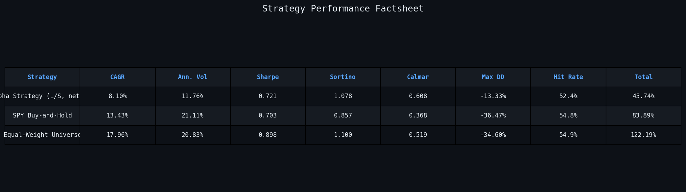
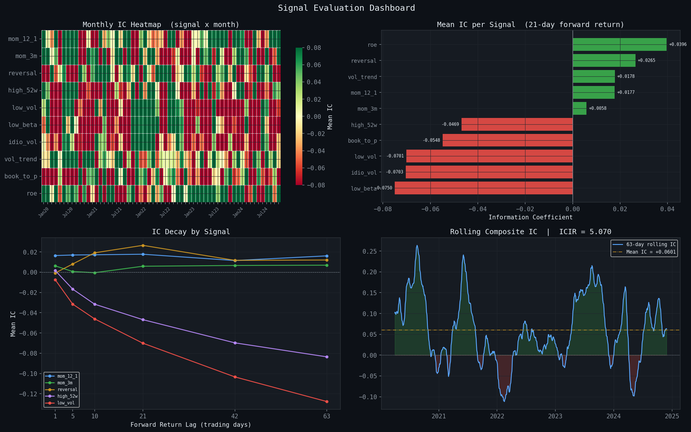
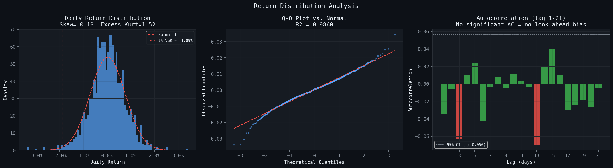
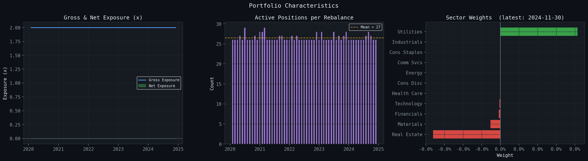

# Systematic Alpha Research Pipeline
### Cross-Sectional Factor Signal Testing, Portfolio Optimisation, and Performance Attribution

---

## Project Objective

This project builds a systematic equity research pipeline from the ground up, starting with raw market data and ending with backtested performance attribution. The main goal was to understand whether cross-sectional factor signals can help identify stocks that are more likely to outperform over the next month.

The question behind the project is simple, but important: can measurable stock characteristics, such as profitability, momentum, volatility, and valuation, provide useful information about future returns?

To test this, the pipeline analyses ten signals across a 50-stock S&P 500 universe. These signals are then used to construct a dollar-neutral and sector-neutral long/short portfolio through constrained quadratic optimisation. The strategy is evaluated using standard performance metrics, signal diagnostics, and Fama-French five-factor attribution.

Every step is designed to be transparent and reproducible, with the methodology grounded in established quantitative finance research.

---

## Methodology

The project follows the standard institutional research workflow used by systematic equity funds.

### 1. Data Preparation
- **Universe:** 50 large-cap S&P 500 constituents across 11 GICS sectors
- **Price data:** Daily adjusted close prices and volume, sourced from Yahoo Finance via `yfinance`
- **Fundamentals:** Current snapshot of book-to-price, return on equity, earnings yield, and related ratios from Yahoo Finance (noted limitation — see below)
- **Benchmark:** Fama-French five-factor daily returns from the Ken French Data Library via `pandas-datareader`
- **Backtest period:** January 2020 to December 2024

### 2. Signal Construction

Ten cross-sectional alpha signals were computed from historical price and fundamental data. Each signal is defined so that a higher value corresponds to a more attractive stock, and each is z-scored cross-sectionally before use.

| Signal | Category | Source |
|--------|----------|--------|
| 12-1 Month Momentum | Momentum | Jegadeesh & Titman (1993) |
| 3-Month Momentum | Momentum | — |
| Short-Term Reversal | Reversal | Jegadeesh (1990) |
| Idiosyncratic Volatility | Low-Vol | Ang, Hodrick, Xing & Zhang (2006) |
| Market Beta (Low Beta) | Low-Vol | Frazzini & Pedersen (2014) |
| 52-Week High Ratio | Momentum | George & Hwang (2004) |
| Volume Trend | Technical | Lee & Swaminathan (2000) |
| Book-to-Price | Value | Fama & French (1992) |
| Return on Equity | Quality | Novy-Marx (2013) |
| Earnings Yield | Value | — |

A weighted composite score is built from signals with positive information coefficients only. Signals with negative IC are excluded from the portfolio. The IC-weighted composite achieved an ICIR of 5.070, compared to the best individual signal (ROE) at 3.048, demonstrating that signal diversification meaningfully improves predictive consistency.

### 3. Portfolio Formation
- **Optimiser:** Constrained quadratic programme solved via CVXPY (CLARABEL solver)
- **Objective:** Maximise `α'w − λ·w'Σw` where `α` is the composite signal vector and `Σ` is the Ledoit-Wolf shrunk covariance matrix
- **Constraints:** Dollar-neutral (`Σwᵢ = 0`), sector-neutral (within each sector), gross leverage ≤ 2×, maximum 8% per position
- **Rebalancing:** Monthly (month-end), walk-forward with no look-ahead
- **Transaction costs:** 10 basis points one-way, applied to net turnover

### 4. Backtesting
- Walk-forward design: signals and covariance are estimated using only data available at the time of each rebalancing date
- Portfolio daily P&L is computed over each holding period
- Transaction costs are deducted on the first day of each new period

### 5. Performance Evaluation
- Sharpe ratio, CAGR, Sortino ratio, Calmar ratio, max drawdown, and monthly return heatmap
- Comparison against SPY (passive benchmark) and equal-weight universe portfolio

### 6. Fama-French Factor Attribution
- OLS regression of daily excess strategy returns on five factors: Market (Mkt-RF), Size (SMB), Value (HML), Profitability (RMW), and Investment (CMA)
- Newey-West HAC standard errors applied to account for return autocorrelation
- Annualised alpha and t-statistic extracted to assess whether residual returns are statistically meaningful

### 7. Signal Diagnostics
- Information Coefficient (IC): Spearman rank correlation between each signal and 21-day forward returns
- Information Coefficient Information Ratio (ICIR): IC / std(IC) × √252
- Hit rate: percentage of months where IC was positive
- IC decay curves computed at horizons of 1, 5, 10, 21, 42, and 63 trading days

### 8. Bias Checks
- Return autocorrelation tested at lags 1 through 21 against a 95% confidence interval (±0.056)
- Positive autocorrelation at lag 1 would indicate look-ahead bias, none was found
- Return distribution tested for normality via Q-Q plot (R² = 0.986) and kurtosis measurement

---

## Key Findings

### Performance Summary (January 2020 – December 2024)

| Metric | Alpha Strategy (L/S, net TC) | SPY Buy-and-Hold |
|--------|------------------------------|------------------|
| Sharpe Ratio | 0.721 | 0.703 |
| Sortino Ratio | **1.078** | 0.857 |
| Calmar Ratio | **0.608** | 0.368 |
| CAGR | 8.11% | 13.43% |
| Annualised Volatility | **11.76%** | 21.11% |
| Max Drawdown | **-13.34%** | -36.47% |
| Mean Rolling 6M Sharpe | 0.64 | — |
| Avg Monthly TC (one-way) | 10.6 bps | — |

The strategy produced a slightly higher Sharpe ratio than SPY, but what stood out more was the difference in risk. Its volatility was much lower, at 11.76% compared with 21.11% for SPY, and its maximum drawdown was also far smaller, at -13.34% versus -36.47%.

The lower CAGR is not surprising. This was a dollar-neutral long/short strategy, so it was not designed to simply benefit from the broad equity market rally between 2020 and 2024. Instead, the aim was to generate returns from relative stock selection while controlling market exposure.

On a downside-adjusted basis, the strategy compares more favourably. Its Sortino ratio was **1.078**, compared with 0.857 for SPY, and its Calmar ratio was 0.608, compared with 0.368 for SPY. This suggests that although the strategy gave up some absolute return, it managed downside risk more effectively than the passive benchmark.

### Fama-French Five-Factor Attribution

| Metric | Value |
|--------|-------|
| Annualised Alpha | +4.43%/yr |
| Alpha t-statistic | +0.953 |
| FF5 R² | 0.153 |

| Factor | Beta |
|--------|------|
| Mkt-RF (Market) | +0.094 |
| SMB (Size) | -0.084 |
| HML (Value) | -0.241 |
| RMW (Profitability) | +0.070 |
| CMA (Investment) | +0.118 |

The Fama-French five-factor regression gave the strategy an R² of 0.153, meaning that only 15.3% of its return variation was explained by standard factor exposures. In other words, most of the strategy’s returns were not simply coming from market beta, size, value, profitability, or investment factors. That is encouraging, because the strategy was designed to capture stock-specific relative performance rather than just load up on common risk premia.

The largest factor exposure was HML at -0.241, which suggests a tilt away from value and toward growth. This makes sense given the 2020–2024 period, where growth-oriented stocks often dominated traditional value names. The market exposure was much smaller, with Mkt-RF at +0.094, which supports the idea that the dollar-neutral construction mostly worked as intended. The positive RMW exposure of +0.070 also fits with the signal results, since ROE was one of the strongest individual predictors in the pipeline.

The annualised alpha was 4.43%, which is interesting, but it should be interpreted carefully. Its t-statistic was 0.953, so the result is not statistically significant at conventional levels. This does not mean the strategy has no value, but it does mean that the evidence is not strong enough to make a firm conclusion from this sample alone.

A major reason for this is the short backtest window. Five years can show whether a pipeline is directionally promising, but it is not usually enough to prove that an alpha is persistent. To reach stronger statistical confidence, a strategy with this level of alpha would likely need a much longer return history, potentially closer to a full market cycle. This is one of the hardest parts of quantitative research: the most interesting signals often need far more data than a single backtest can comfortably provide.

### Signal IC and ICIR Results (21-day horizon)

**Signals that contributed positively:**

| Signal | IC | ICIR | Hit Rate |
|--------|----|------|----------|
| Return on Equity (`roe`) | +0.0396 | +3.048 | 57.0% |
| Short-Term Reversal (`reversal`) | +0.0265 | +1.840 | 51.9% |
| Volume Trend (`vol_trend`) | +0.0178 | +1.785 | 54.4% |
| 12-1 Momentum (`mom_12_1`) | +0.0177 | +1.027 | 56.8% |
| 3-Month Momentum (`mom_3m`) | +0.0058 | +0.339 | 52.3% |

**Signals that hurt performance:**

| Signal | IC | ICIR | Hit Rate |
|--------|----|------|----------|
| Idiosyncratic Volatility (`idio_vol`) | -0.0703 | -5.320 | 36.4% |
| Book-to-Price (`book_to_p`) | -0.0548 | -4.721 | 41.1% |
| Realised Volatility (`low_vol`) | -0.0701 | -4.053 | 38.9% |
| Market Beta (`low_beta`) | -0.0750 | -3.905 | 38.2% |
| 52-Week High Ratio (`high_52w`) | -0.0469 | -2.631 | 46.8% |

Average IC across all ten signals: -0.0210

### Autocorrelation and Bias Check

The autocorrelation check was one of the most important diagnostics in the project, because it helps test whether the backtest is behaving realistically through time. In particular, I wanted to see whether the strategy returns showed suspicious patterns that could point to look-ahead bias or data leakage.

The lag 1 autocorrelation stayed within the 95% confidence band, which is a good sign. If there had been a large spike at the first lag, it could have suggested that the strategy was using information too early or that the return series was being distorted by a timing issue. In this case, there was no clear evidence of look-ahead bias from the autocorrelation plot.

There were some minor negative autocorrelations at lags 3 and 13. These were not large enough to raise a major concern, and they are reasonably consistent with the structure of the strategy. The lag 3 effect may reflect short-term mean reversion, while the lag 13 effect could be linked to the monthly rebalancing cycle.

The return distribution also looked relatively well-behaved. The skew was -0.19, which is close to symmetric, while the excess kurtosis was 1.52, suggesting mild fat tails rather than an extreme departure from normality. The Q-Q plot had an R² of 0.986, which supports the idea that the daily returns were approximately normal, although not perfectly so.

Finally, the 1% daily Value-at-Risk was -1.89%. In practical terms, this means that on the worst 1% of days, the strategy would be expected to lose at least around 1.89%. This is a useful risk figure because it gives a more intuitive sense of downside exposure beyond just looking at volatility or drawdown.

### Portfolio Construction Diagnostics

- Mean active positions per rebalance: 27 out of 50 stocks
- Gross exposure: flat at 2.0× throughout. Optimiser consistently hits the leverage constraint
- Net exposure: flat at 0.0× Dollar-neutrality enforced at every rebalance

---

## Interpretation

The strategy mostly behaved in the way I hoped it would. On a basic risk-adjusted basis, it performed close to SPY, but the more important result was how differently it handled risk. The strategy’s maximum drawdown was -13.34%, compared with -36.47% for SPY. That is a meaningful difference, especially from the perspective of an investor who cares about protecting capital during difficult periods.

This is where the Sortino and Calmar ratios are useful. They show that the strategy’s strength was not really about producing the highest raw return. Instead, its advantage came from managing downside risk more effectively. In other words, the strategy gave up some upside, but it also avoided a large part of the drawdown that came with holding the market passively.

The most interesting part of the project was seeing which signals actually worked. Return on equity was the strongest predictor, with an ICIR of +3.048 and a hit rate of 57%. It was not just good in one isolated month. It was relatively consistent across the backtest, which made it stand out. Short-term reversal also contributed positively and seemed to add useful predictive information.

These results make sense. Profitability and short-term mean reversion are both well-known ideas in quantitative finance, but it was still valuable to see them appear clearly in my own pipeline. It made the project feel less like an abstract coding exercise and more like a real research process where the data either supports the theory or challenges it.

What surprised me more was the weakness of the low-volatility and value signals. Low beta, idiosyncratic volatility, and book-to-price all produced strongly negative ICIR values, meaning they consistently pointed in the wrong direction during the backtest period. I do not think this automatically means those signals are useless. A more likely explanation is that the 2020–2024 period was an extremely difficult environment for those factors. High-growth and high-volatility technology stocks dominated much of the market, so positioning toward cheaper and lower-volatility stocks was often the wrong trade.

That distinction matters. A signal can fail because it has no predictive value, or it can fail because the market regime is temporarily working against it. This is why the IC diagnostics were so important. They helped separate signals that were genuinely useful in this period from signals that were adding noise or even hurting performance.

The IC-weighting step handled this well. By excluding the five signals with negative IC values, the pipeline automatically shifted the weight toward the signals that were actually working. The composite signal reached an ICIR of 5.070, which was higher than any individual signal. This suggests that combining signals can be powerful when the weaker inputs are filtered properly. It reduces noise while keeping the useful information.

The alpha result should also be treated honestly. The strategy produced an annualised alpha of 4.43%, but the t-statistic was only 0.953. That is not enough to claim statistical significance. Five years of data can show whether a strategy is promising, but it is not enough to prove that the alpha is persistent.

Overall, I think the results support the idea that the pipeline is a strong research framework rather than a finished trading system. It controlled drawdowns well, identified harmful signals through IC analysis, and concentrated exposure in quality and mean-reversion effects with a reasonable theoretical basis. At the same time, the short sample period and factor regime mean the results need to be tested further before drawing stronger conclusions.

---

## Limitations

No backtest is perfect, and this project has several limitations that are important to be honest about.

**Survivorship bias.**
The stock universe is built from the current S&P 500 membership, rather than the historical membership at each point in time. This means companies that were removed from the index during the backtest period are missing from the analysis. In practice, some of those companies may have been removed after poor performance or financial distress. Because of this, the backtest may make the strategy look better than it would have looked in real time.

**Fundamental data is not point-in-time.**
The balance sheet and profitability data were sourced from yfinance reflects currently available information, not necessarily the exact data that would have been known at each historical rebalancing date. This is especially important for fundamental signals such as ROE, book-to-price, and earnings yield. In a more professional version of the project, this would need to be replaced with a proper point-in-time dataset from a source such as Compustat or Bloomberg.

**The sample period is short.**
Five years is useful for testing the pipeline, but it is not long enough to make strong conclusions about whether the alpha is persistent. The 2020–2024 period was also unusual. It included the COVID crash, a strong post-pandemic rally, a sharp interest rate hiking cycle, and the rise of AI-driven equity leadership. That is a lot to fit into one sample. It gives interesting evidence, but not a complete view of how the strategy would behave across different market regimes.

**The strategy has an implicit growth tilt.**
The Fama-French regression showed a negative HML exposure of -0.241, which means the strategy leaned away from value and toward growth. This matters because part of the strategy’s performance may have come from being exposed to a growth-friendly market environment, rather than purely from unique stock-selection alpha.

**The transaction cost model is simplified.**
The backtest uses a flat one-way transaction cost of 10 basis points. This is a reasonable starting assumption, but it does not fully capture real trading frictions. In reality, costs would depend on bid-ask spreads, liquidity, order size, turnover, and market impact. At an institutional scale, market impact would likely be much more important than a simple flat cost assumption.

**Small dataset.**
The strategy only runs across 50 stocks, which limits diversification. A larger production-style equity strategy would normally test signals across hundreds or thousands of stocks, often across multiple regions. With only 50 names, single-stock effects can have a much larger impact on the results.

**Factor crowding is not captured.**
Some of the strongest signals in this project, especially quality and momentum-related signals, are widely followed by systematic investors. If too many funds trade similar signals, the opportunity can become crowded, and future returns may weaken. A historical backtest cannot fully show this risk, but it is important to keep in mind when interpreting the results.

Overall, these limitations do not make the project invalid. Instead, they show where the research would need to improve before it could be treated as a live trading strategy. The pipeline is a strong foundation, but the next step would be to test it with cleaner data, a larger universe, a longer history, and more realistic trading assumptions.

---

## Future Improvements

There are several ways this project could be improved to make the research more robust and closer to a production-quality strategy.

**Extend the backtest period.**
The current backtest is useful, but a longer time period would make the results much more reliable. Testing the pipeline over **15–20 years** would help assess whether the alpha is persistent across different market environments. It would also include major periods such as the 2008 financial crisis, the long low-volatility bull market of the 2010s, the 2020 COVID crash, and the 2022 inflation and rate-hiking shock. A strategy that performs reasonably across several regimes is much more convincing than one that only works in a short window.

**Use point-in-time fundamental data.**
One of the most important improvements would be replacing the current `yfinance` fundamental data with a proper point-in-time dataset. This would make sure that each rebalance only uses the financial information that was actually available at that date. Data from sources such as Compustat through WRDS, Bloomberg, or another commercial provider would make the fundamental signals much cleaner and reduce the risk of look-ahead bias.

**Expand the signal universe.**
The project currently uses ten signals, which is a good starting point, but there is a lot more that could be tested. Future versions could include earnings revisions, analyst upgrades and downgrades, short interest, option-implied volatility, and text-based signals from SEC filings or company reports. Adding different types of signals would help diversify the sources of alpha and reduce dependence on only a few factor groups.

**Use a survivorship-bias-free universe.**
A stronger version of the project would use a dynamic stock universe that reflects actual S&P 500 membership at each point in history. This would include companies that later left the index, rather than only looking at today’s constituents. It would make the backtest more realistic and reduce the risk of overstating performance.

**Compare different portfolio construction methods.**
The current version uses constrained quadratic optimisation through CVXPY, which is useful because it allows for dollar-neutrality, sector-neutrality, and risk control. However, it would be interesting to compare this with simpler and alternative methods, such as quintile long/short portfolios, equal-weighted signal portfolios, or Hierarchical Risk Parity. This would help separate how much of the performance comes from the signals themselves and how much comes from the optimisation process.

**Add regime-aware signal weighting.**
The IC analysis showed that some signals worked much better than others during the 2020–2024 period. Value and low-volatility signals, in particular, struggled in that environment. A future version of the pipeline could include a regime-detection layer that adjusts signal weights depending on the market environment. For example, macro variables or a Hidden Markov Model could be used to identify whether the market is in a growth-led, value-led, high-volatility, or defensive regime. This would make the strategy more adaptive, although it would also need to be tested very carefully to avoid overfitting.

**Run a proper out-of-sample test.**
The current project uses IC analysis to select and weight signals, then evaluates the strategy over the same broad period. A more rigorous version would separate the research period from the testing period. For example, signal weights could be estimated using data before 2020, and then the strategy could be evaluated only on 2020–2024 data. This would give a clearer view of whether the signals continue to work on unseen data.

Overall, the next step would be to move from a successful research prototype toward a more realistic testing framework. The main priorities would be cleaner data, a longer history, a larger universe, and stricter out-of-sample validation.

---

## Academic References

* Jegadeesh, N., & Titman, S. (1993). Returns to buying winners and selling losers: Implications for stock market efficiency. *The Journal of Finance*, 48(1), 65–91.

* Fama, E. F., & French, K. R. (1993). Common risk factors in the returns on stocks and bonds. *Journal of Financial Economics*, 33(1), 3–56.

* Fama, E. F., & French, K. R. (2015). A five-factor asset pricing model. *Journal of Financial Economics*, 116(1), 1–22.

* Ang, A., Hodrick, R. J., Xing, Y., & Zhang, X. (2006). The cross-section of volatility and expected returns. *The Journal of Finance*, 61(1), 259–299.

* Frazzini, A., & Pedersen, L. H. (2014). Betting against beta. *Journal of Financial Economics*, 111(1), 1–25.

* Novy-Marx, R. (2013). The other side of value: The gross profitability premium. *Journal of Financial Economics*, 108(1), 1–28.

* Markowitz, H. (1952). Portfolio selection. *The Journal of Finance*, 7(1), 77–91.

* Ledoit, O., & Wolf, M. (2004). A well-conditioned estimator for large-dimensional covariance matrices. *Journal of Multivariate Analysis*, 88(2), 365–411.

* Newey, W. K., & West, K. D. (1987). A simple, positive semi-definite, heteroskedasticity and autocorrelation consistent covariance matrix. *Econometrica*, 55(3), 703–708.

* López de Prado, M. (2018). *Advances in Financial Machine Learning*. Wiley.

---

*Built using Python and Google Colab. All data sourced from publicly available APIs.*
